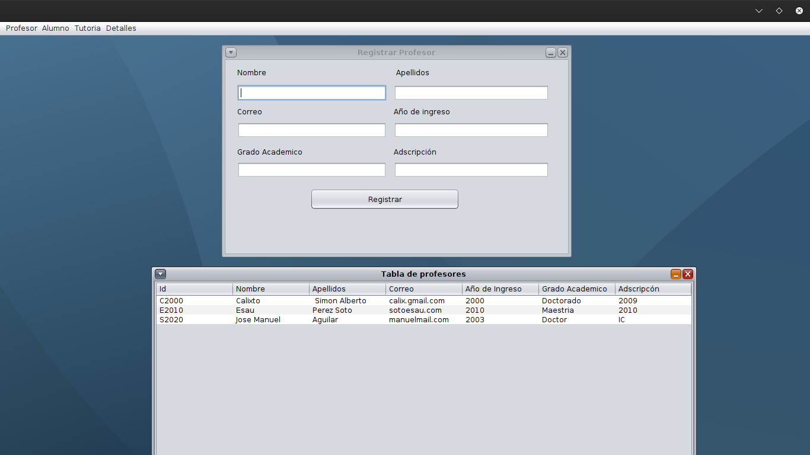
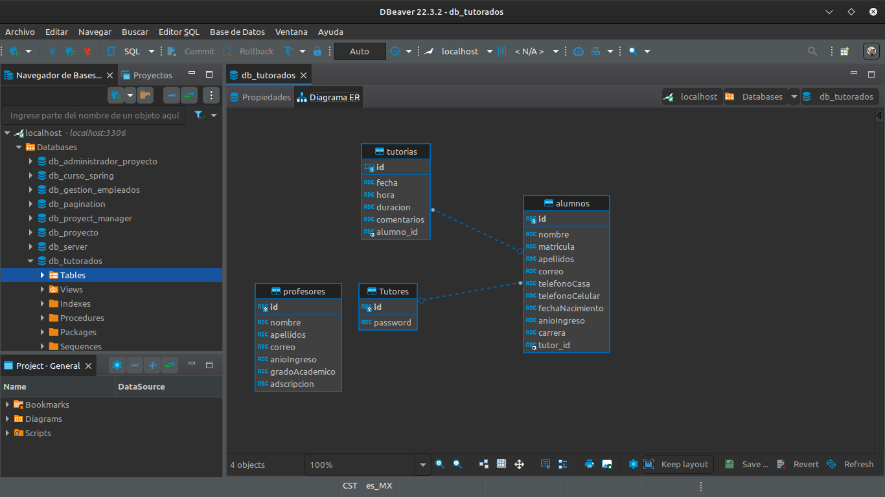

# Reporte de Tutorados 

## Descripción
Este es un pequeño si   stema de reporte que se encarga de
registrar profesores alumnos, donde los profesores pueden tener el 
rol de ser tutores de muchos alumnos.
<br>
Proyecto final de materia programacion funcional, pasamos este codigo de haskell a java con la api stream 8 de java.
<br>
## Requerimientos
El Comité Institucional de Tutorías (CIT) de la Universidad del Papaloapan requiere un sistema para gestionar información respecto al seguimiento tutorial de los alumnos de todas las carreras del campus Loma Bonita. De cada estudiante se desea ingresar información como, matrícula, nombre(s), apellidos, correo, teléfono de casa o teléfono celular, fecha nacimiento, año de ingreso a la universidad, carrera. Además de los datos personales, es importante ir generando un historial de seguimiento en el avance académico, problemas académicos y reuniones para tutorías. Cada estudiante será identificado con una clave que es formada por su matrícula, más los dos últimos dígitos del año de ingreso. Un(a) profesor(a) puede ser tutor(a) de mínimo 1 estudiante y máximo 10. La información que se requiere gestionar del profesor es: grado académico, nombre, apellidos, adscripción (carrera), correo, teléfono celular, año de ingreso. Un profesor será identificado por las iniciales de su nombre más, el año de ingreso a laborar, más un número consecutivo. Durante el periodo semestral, cada tutor debe tener por lo menos una tutoría con cada estudiante que tiene asignado. De cada reunión tutorial (presencial o virtual) se debe guardar evidencia de la siguiente información: fecha y hora de la reunión, duración de la reunión, comentarios relevantes de cada estudiante acerca de su avance y/o problemas académicos. Por lo tanto, cada profesor que tenga el rol de tutor contará con una contraseña que será generada automáticamente. La contraseña será generada de forma aleatoria, de acuerdo a los siguiente. Longitud mínimo 8 caracteres, se deben incluir letras minúsculas, letras mayúsculas, número no consecutivos y símbolos especiales. Ya que es importante llevar el seguimiento del progreso académico del estudiantes, es importante que se tenga registro de las materias y calificaciones que va obteniendo cada estudiantes.

## ¿Cómo ejecutar el proyecto?
Es importante conocer que se debe de crear la base de datos en MYSQL y modificar el archivo "config.propierties"
<br>
Para ejecutar el proyecto se puede hacer mediante un ide como IntelligeIDEA o por medio de maven.
<br>
1. Ejecuta el siguiente comando para instalar las dependecias:

```
mvn install
```
2. Para limpiar el proyecto
```
mvn clean install
```
3. Para compilar y generar el .jar del proyecto
```
mvn package
```
4. Ejecuta el proyecto con java
```
java -jar target/ReporteTutorados-1.0-SNAPSHOT.jar
```
## Visualizacion del proyecto
1. Imagen de la ventana principal

2. Imagen de la relación y construcción de la base de datos 

